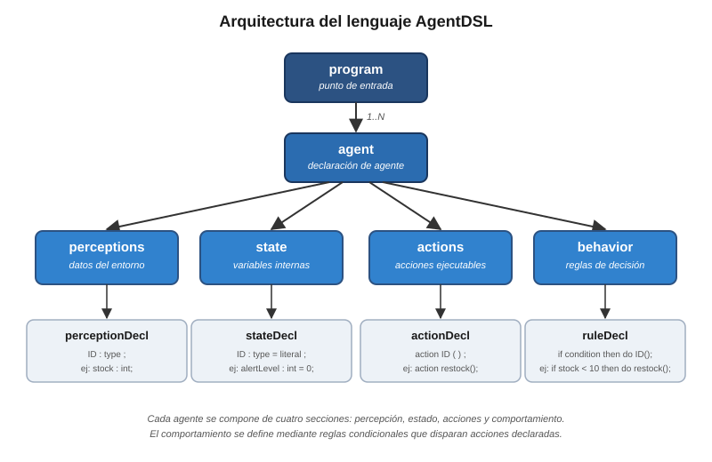
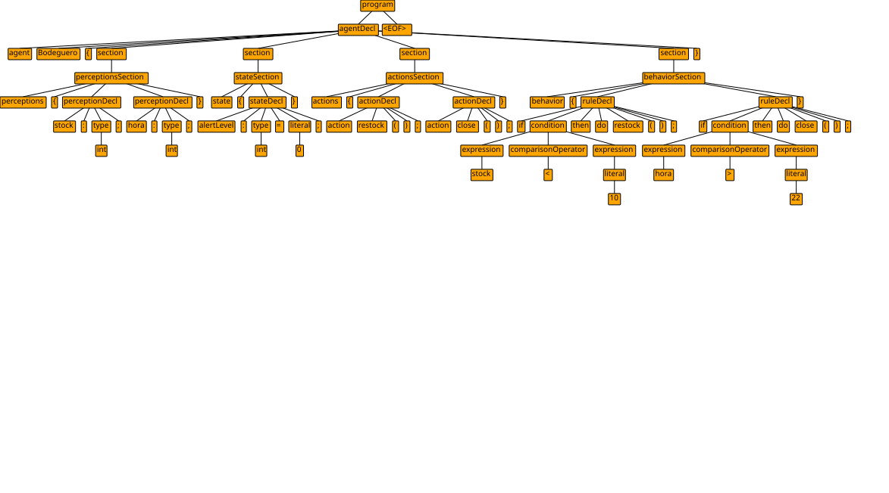

# Trabajo Parcial - Teoría de Compiladores

**Universidad Peruana de Ciencias Aplicadas**
**Carrera de Ciencias de la Computación**

**Docente:** Jose Luis Soncco Alvarez

**Alumnos:**
- Cielo Luwidka Chavez Merino - U20191E443
- Alvaro Manuel De Cossio Velasquez - U20221F812
- Loana Colleen Rodriguez Matos - U202115571
- Joaquin Sebastian Ruiz Ramirez - U20201F678

**Mayo del 2026**

---

## Problema y motivación

Hoy en día, el desarrollo de agentes inteligentes requiere el uso de lenguajes de propósito general como Python o Java. Si bien estos lenguajes son poderosos, obligan al desarrollador a mezclar la lógica de comportamiento del agente con detalles técnicos de implementación: clases, métodos, estructuras de control anidadas y manejo de estado explícito. El resultado es un código difícil de leer, mantener y escalar, especialmente cuando el número de agentes o la complejidad de sus reglas crece. Esto implica la carencia de un lenguaje de programación diseñado específicamente para describir agentes inteligentes basados en percepción y acción. La lógica que define cómo interactúa un agente con el entorno queda enterrada dentro de código técnico que no refleja directamente el comportamiento que se quiere modelar.

### ¿Por qué es importante resolverlo?

Los agentes inteligentes tienen aplicaciones en robótica, automatización de procesos, simulaciones, sistemas de monitoreo y videojuegos, entre otros. En todos estos casos, los especialistas del dominio conocen perfectamente la lógica de decisión que necesitan, pero no pueden expresarla directamente a otras áreas porque las herramientas disponibles exigen conocimientos de programación avanzados. Esto genera una brecha entre quienes entienden el problema y quienes pueden implementarlo.

### ¿Existe alguna solución actualmente?

Existen frameworks como JADE o herramientas de behavior trees en motores de videojuegos, pero estos son bibliotecas sobre lenguajes existentes, no lenguajes independientes. Requieren instalación de entornos complejos, conocimiento previo del lenguaje base y una curva de aprendizaje que podría variar entre considerable y altísima.

La propuesta es desarrollar un lenguaje declarativo y de dominio específico que permita describir agentes inteligentes en términos de lo que perciben, el estado en que se encuentran y las acciones que ejecutan. Este lenguaje busca hacer accesible la definición de comportamientos de agentes no solo a programadores, sino también a profesionales de otras áreas que necesitan expresar lógica de decisión sin depender de código complejo.

---

## Objetivos

¿Qué necesitamos para desarrollar un lenguaje que permita definir agentes inteligentes basados en percepción y acción?

- Definir un modelo de agente que establezca qué elementos lo componen: variables percibidas del entorno, estado interno y acciones ejecutables.
- Diseñar una sintaxis declarativa que permita expresar ese modelo de forma legible, sin requerir conocimientos de programación avanzados.
- Implementar una gramática formal en ANTLR4 que capture la sintaxis del lenguaje mediante reglas del parser y del lexer, organizando el código del agente en secciones bien delimitadas.
- Establecer un conjunto de tipos primitivos (int, float, string, bool) que permita representar las percepciones y el estado del agente con la precisión necesaria.
- Sentar las bases para un análisis semántico posterior y la generación de código ejecutable mediante LLVM, que materialice el comportamiento del agente como un ciclo continuo de percepción, decisión y acción.

---

## Gramática en ANTLR4

El lenguaje AgentDSL se define mediante una gramática libre de contexto implementada en ANTLR4. La gramática está organizada en dos partes: las reglas del parser, que definen la estructura sintáctica del lenguaje, y las reglas del lexer, que definen los tokens reconocidos.



*Figura 1. Arquitectura jerárquica del lenguaje AgentDSL. Un programa contiene uno o más agentes, y cada agente se descompone en cuatro secciones que separan claramente la percepción del entorno, el estado interno, las acciones disponibles y las reglas de comportamiento.*

### Estructura general

Un programa en AgentDSL consiste en uno o más agentes. Cada agente está compuesto por cuatro secciones bien delimitadas:

- **perceptions:** declara las variables que el agente percibe del entorno.
- **state:** declara las variables internas del agente y su valor inicial.
- **actions:** declara las acciones que el agente puede ejecutar.
- **behavior:** define las reglas de comportamiento mediante condiciones que disparan acciones.

Esta separación por secciones busca que el código sea legible incluso para quienes no son programadores, ya que cada parte del agente se ubica en un lugar específico y predecible.

### Tipos de datos soportados

El lenguaje soporta cuatro tipos primitivos: `int`, `float`, `string` y `bool`. Estos cubren los casos de uso más comunes para describir percepciones y estados de agentes.

### Reglas semánticas

Más allá de la sintaxis, AgentDSL contempla validaciones semánticas como la detección de variables no declaradas, declaraciones duplicadas, compatibilidad de tipos en comparaciones y advertencias para variables que nunca se usan. Estas validaciones aseguran que un programa sintácticamente correcto también sea semánticamente válido.

### Ejemplo de programa válido

```
agent Bodeguero {
  perceptions {
    stock : int;
    hora : int;
  }
  state {
    alertLevel : int = 0;
  }
  actions {
    action restock();
    action close();
  }
  behavior {
    if stock < 10 then do restock();
    if hora > 22 then do close();
  }
}
```



*Figura 2. Árbol sintáctico generado por ANTLR4 al parsear el programa de ejemplo. Cada nodo representa una regla de la gramática y demuestra cómo el parser reconoce la estructura jerárquica del agente Bodeguero.*

### Gramática completa

```antlr
grammar AgentDSL;

// ========== REGLAS DEL PARSER ==========

program
    : agentDecl+ EOF
    ;

agentDecl
    : AGENT ID LBRACE section* RBRACE
    ;

section
    : perceptionsSection
    | stateSection
    | actionsSection
    | behaviorSection
    ;

perceptionsSection
    : PERCEPTIONS LBRACE perceptionDecl* RBRACE
    ;

perceptionDecl
    : ID COLON type SEMI
    ;

stateSection
    : STATE LBRACE stateDecl* RBRACE
    ;

stateDecl
    : ID COLON type (ASSIGN literal)? SEMI
    ;

actionsSection
    : ACTIONS LBRACE actionDecl* RBRACE
    ;

actionDecl
    : ACTION ID LPAREN RPAREN SEMI
    ;

behaviorSection
    : BEHAVIOR LBRACE ruleDecl* RBRACE
    ;

ruleDecl
    : IF condition THEN DO ID LPAREN RPAREN SEMI
    ;

condition
    : expression comparisonOperator expression
    ;

expression
    : ID
    | literal
    ;

comparisonOperator
    : GT | LT | EQ | NEQ | GTE | LTE
    ;

type
    : INT_TYPE
    | FLOAT_TYPE
    | STRING_TYPE
    | BOOL_TYPE
    ;

literal
    : INT
    | FLOAT
    | STRING
    | TRUE
    | FALSE
    ;

// ========== REGLAS DEL LEXER ==========

// Palabras clave
AGENT       : 'agent';
PERCEPTIONS : 'perceptions';
STATE       : 'state';
ACTIONS     : 'actions';
ACTION      : 'action';
BEHAVIOR    : 'behavior';
IF          : 'if';
THEN        : 'then';
DO          : 'do';

// Tipos
INT_TYPE    : 'int';
FLOAT_TYPE  : 'float';
STRING_TYPE : 'string';
BOOL_TYPE   : 'bool';

// Booleanos
TRUE  : 'true';
FALSE : 'false';

// Operadores de comparación
GT  : '>';
LT  : '<';
EQ  : '==';
NEQ : '!=';
GTE : '>=';
LTE : '<=';

// Símbolos de puntuación y asignación
ASSIGN : '=';
COLON  : ':';
SEMI   : ';';
COMMA  : ',';
LBRACE : '{';
RBRACE : '}';
LPAREN : '(';
RPAREN : ')';

// Literales
FLOAT  : [0-9]+ '.' [0-9]+;
INT    : [0-9]+;
STRING : '"' (~["\\] | '\\' .)* '"';
ID     : [a-zA-Z_][a-zA-Z0-9_]*;

// Espacios y comentarios (se ignoran)
WS      : [ \t\r\n]+ -> skip;
COMMENT : '//' ~[\r\n]* -> skip;
```
